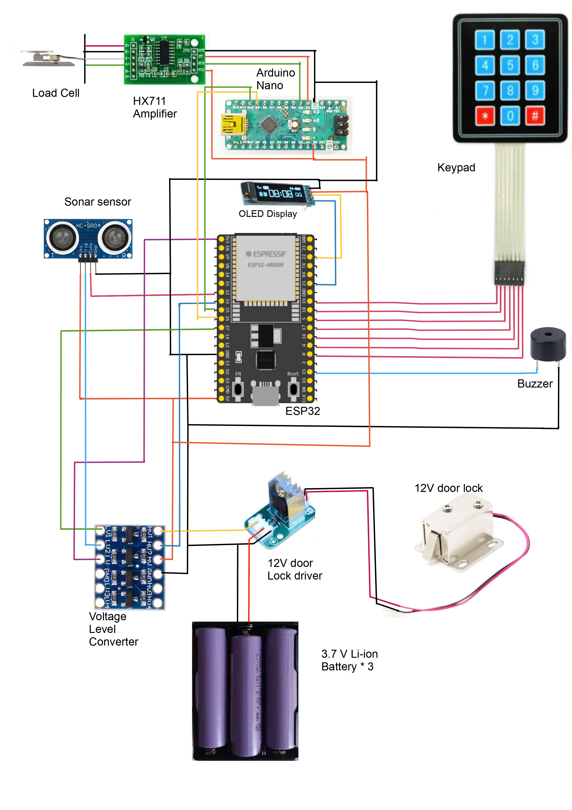

# DeliBox: Smart Home Delivery Box  

Welcome to **DeliBox**, a secure and automated solution for receiving parcels without requiring your physical presence.  

## About  
DeliBox is a smart home delivery box equipped with modern features to ensure the safety and reliability of your deliveries. With DeliBox, you can:  
- Operate the system remotely via Telegram.  
- Use unique OTP generation for each delivery to enhance parcel security.  
- Rely on advanced features like a weight sensor, sonar, and an alarm system for added reliability and security.  

## Features  
- **Automated Parcel Receiving:** Automatically receives parcels securely in your absence.  
- **Telegram Integration:** Control and monitor deliveries remotely through a Telegram bot.  
- **OTP Security:** Unique OTP generation for secure access during each delivery.  
- **Enhanced Reliability:** Includes weight sensors, sonar detection, and an alarm system for robust parcel handling.  

## Circuit Diagram  
The DeliBox hardware setup is illustrated in the circuit diagram below:  

  

## Codes  
The source code for the DeliBox system is divided into modules to simplify customization and implementation:  
1. [Weight Thresholding for Arduino Nano](weight_thresholding_for_arduino_nano.md)  
2. [DeliBox Operational Code for ESP](deliBox_operational_code_esp.md)  

## Contact  
For questions or support, feel free to contact us at:  
**Email:** [buet404.18.g2@gmail.com](mailto:buet404.18.g2@gmail.com)  

## Credits  
Developed by **BUET 404-18 G2**  
&copy; BUET 404-18 G2  
